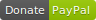

# [Insert Course Number] [Insert Course Title]

## History

* [Insert version tags in backward order (most recent first); remember to tag the commit on the master branch]

## Introduction

[Describe what the course is about]

## Notes

[Any special notes about the course project and/or content]

## License

[Change the License as necessary; most courses are not the MIT license]

The course template is licensed under the MIT license. The corresponding courseware when developed is not. You may use and modify all or part of it as you choose, as long as attribution to the source is provided per the license. See the details in the [license file](./LICENSE.md) or at the [Open Source Initiative](https://opensource.org/licenses/MIT)

<!---
[//]: # ## Support
[//]: # 
[//]: # [Add this Support section if the course is a give-away]
[//]: # 
[//]: # Since I give stuff away for free, and if you would like to keep seeing more stuff like this, then please consider
[//]: # a contribution to *Joel's Coffee Fund* at **Smallrock Internet** to help keep the good stuff coming :) 
[//]: #
[//]: # 
--->

## Contributing

We are always looking for ways to make the template better. But remember: Keep it simple. Keep it minimal. Don't add every single feature just because you can, add a feature when a feature is required.

## Authors or Acknowledgments

* [Insert author name]
